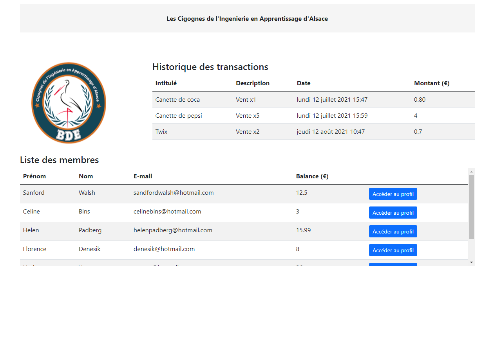

## ERP Money Frontend 💰 💻
  

    

  

## Languages and Tools

     <a href="https://www.photoshop.com/en" target="_blank" rel="noreferrer"> 

### [EN] ERP Money ?

This application was developed as part of a school project around microservices and ERP. In team, I developed the front and back end of the transaction management microservice.

### [FR] ERP Money ?

Cette application a été développée dans le cadre d'un projet scolaire autour des microservices et des ERP. En équipe, j'ai développé la partie front et back du microservice de gestion de transaction.
